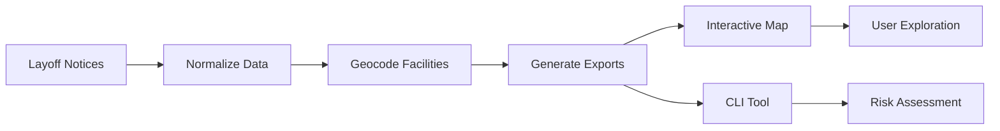

# Layoff Notice Match Tool

[](https://www.python.org/downloads/)
[](LICENSE.txt)
[](https://github.com/psf/black)
[](CONTRIBUTING.md)

A deterministic, evidence-first tool for exploring how facilities and job titles relate to published layoff notices.

The project combines:
- 🗺️ An interactive, client-rendered map for spatial exploration
- 🔍 A reproducible Python CLI for facility- and role-specific risk analysis
- 📊 A data pipeline for normalizing and validating WARN notice data

> **Important:** This tool does **not** predict individual layoff likelihood.  
> It only matches user-selected inputs to explicitly published notice data and shows the supporting evidence and nearby context.

---

## 📑 Table of Contents

- [Features](#-features)
- [Quick Start](#-quick-start)
- [Installation](#-installation)
- [Usage](#-usage)
- [Documentation](#-documentation)
- [Project Structure](#-project-structure)
- [Development](#-development)
- [Privacy & Safety](#-privacy--safety)
- [License](#-license)

---

## ✨ Features

### What This Is
- ✅ Evidence-first matching tool against official layoff notices
- ✅ Deterministic, testable system (no ML, no prediction)
- ✅ Client-rendered map for exploration + local CLI for analysis
- ✅ Geographic proximity reasoning using published data

### What This Is Not
- ❌ Not a prediction model
- ❌ Not a probability calculator
- ❌ Not an HR system
- ❌ Not a claim about any individual's likelihood of being laid off

---

## 🚀 Quick Start

### 📘 For Non-Technical Users
**New to coding?** Start here:
- **[HOW TO USE THIS TOOL](HOW_TO_USE_THIS_TOOL.md)** - Complete step-by-step guide
- **[QUICK START](QUICK_START.md)** - 5-minute quick reference

### 👨‍💻 For Technical Users

#### Prerequisites
- Python 3.8 or higher
- Git (for cloning)
- Modern web browser (for map visualization)

#### Installation

```bash
# Clone the repository
git clone https://github.com/chromaglow/27z-6_role_evaluator.git
cd 27z-6_role_evaluator

# Create virtual environment
python -m venv venv
source venv/bin/activate  # On Windows: venv\Scripts\activate

# Install dependencies
pip install -r requirements.txt
```

For detailed installation instructions, see [INSTALL.md](INSTALL.md).

---

## 💻 Usage

### Interactive Map

**Option A (PowerShell):**
```powershell
powershell -ExecutionPolicy Bypass -File scripts\run_map.ps1
```

**Option B (Batch):**
```cmd
scripts\run_map.bat
```

Then open your browser to `http://localhost:8000`

The map is a static Leaflet application served locally. Facilities are labeled directly on the map and colored by impact severity.

### Command-Line Interface (CLI)

**Direct usage:**
```bash
python tools\risk_assessment.py --facility SEA93 --title "Product Manager III"
```

**Using wrapper script:**
```powershell
powershell -ExecutionPolicy Bypass -File scripts\risk.ps1 -Facility SEA93 -Title "Product Manager III"
```

**With proximity options:**
```bash
python tools\risk_assessment.py --facility SEA93 --title "Product Manager III" --nearest 5 --radius_km 30
```

> 💡 **Tip:** The map includes a "Copy CLI" button in each facility popup that generates a ready-to-run command for deeper analysis.

---

## 📚 Documentation

Start here for detailed information:

| Document | Description |
|----------|-------------|
| [SPEC.md](docs/SPEC.md) | Source-of-truth product specification |
| [DATA_SCHEMA.md](docs/DATA_SCHEMA.md) | Normalized data model and structure |
| [SCORING.md](docs/SCORING.md) | Tiering and explainability rules |
| [DECISIONS.md](docs/DECISIONS.md) | Architectural decisions and rationale |
| [UI_WIREFRAME.md](docs/UI_WIREFRAME.md) | UI structure and design intent |
| [INSTALL.md](INSTALL.md) | Detailed installation guide |
| [CONTRIBUTING.md](CONTRIBUTING.md) | Development guidelines |

---

## 📁 Project Structure

```
27z-6_role_evaluator/
├── app/                    # Static Leaflet map (HTML/JS) and generated GeoJSON
│   └── public/
│       ├── index.html      # Map UI
│       └── facilities.geojson
├── data/                   # Source notices, normalized datasets, geocodes
│   ├── raw/                # Original PDF notices
│   ├── normalized/         # Canonical JSON datasets
│   ├── exports/            # Generated CSV/GeoJSON exports
│   └── facilities/         # Facility geocoding data
├── docs/                   # Product specs, decisions, scoring rules
├── scripts/                # One-command wrappers and build helpers
│   ├── run_map.ps1         # Start map server
│   ├── build_map_data.bat  # Regenerate map data
│   └── risk.ps1            # CLI wrapper
├── tools/                  # Python data pipelines and CLI
│   ├── risk_assessment.py  # Main CLI tool
│   ├── export_*.py         # Data export scripts
│   └── geocode_*.py        # Geocoding utilities
├── requirements.txt        # Production dependencies
├── requirements-dev.txt    # Development dependencies
├── setup.py                # Package installation config
├── pyproject.toml          # Modern Python project config
└── README.md               # This file
```

---

## 🛠️ Development

### Setting Up Development Environment

```bash
# Install development dependencies
pip install -r requirements-dev.txt

# Install pre-commit hooks (optional)
pre-commit install

# Run tests
pytest

# Format code
black tools/

# Type checking
mypy tools/

# Linting
flake8 tools/
```

### Data Pipeline

The project includes several data processing scripts:

```bash
# Build combined dataset from notices
python tools/build_combined.py

# Refresh facility geocodes
python tools/geocode_refresh_from_addresses.py

# Export facility rollup
python tools/export_facility_rollup_from_impacts.py

# Generate map GeoJSON
python tools/export_facilities_geojson.py

# Or use the all-in-one script
scripts\build_map_data.bat
```

### Contributing

We welcome contributions! Please see [CONTRIBUTING.md](CONTRIBUTING.md) for guidelines.

---

## 🔒 Privacy & Safety

- **Client-only execution:** Map UI is client-rendered
- **No data transmission:** No user input leaves the local machine
- **No personal data:** No personal employee data is stored or displayed
- **Evidence-based:** All outputs are derived from published notice data
- **Deterministic logic:** All matching and scoring is inspectable and testable

---

## 📊 Development Status

**Current Version:** v1.0-internal (Initial viable prototype)

**Current Focus:**
- ✅ Data correctness and geocoding accuracy
- ✅ Scoring and explainability validation
- 🔄 Packaging and internal distribution workflows
- 🔄 Testing and code quality improvements

---

## 🤝 How It Works (High Level)



1. Layoff notices are normalized into a canonical dataset
2. Facilities are geocoded and rolled up by impact
3. The map visualizes facilities, impact magnitude, and top affected roles
4. Users can explore spatial clusters and copy a reproducible CLI command
5. The CLI performs a deterministic match and explains the supporting evidence

All logic is deterministic and inspectable.

---

## 📄 License

MIT License. See [LICENSE.txt](LICENSE.txt) for details.

---

## 🙏 Acknowledgments

- Built with [Leaflet](https://leafletjs.com/) for map visualization
- Uses [pdfplumber](https://github.com/jsvine/pdfplumber) for PDF text extraction
- Geocoding powered by [geopy](https://github.com/geopy/geopy) and OpenStreetMap Nominatim

---

## 📞 Support

For questions or issues:
1. Check the [documentation](docs/)
2. Review [existing issues](https://github.com/chromaglow/27z-6_role_evaluator/issues)
3. Open a new issue with detailed information

---

**Made with ❤️ for evidence-based decision making**
